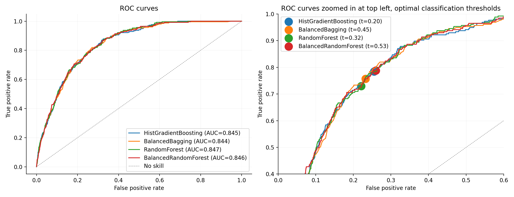

## Introduction
In today's digital banking, converting leads into customers presents a considerable challenge. Leads come from diverse channels like online searches, display ads, email campaigns and affiliate partnerships. Happy Customer Bank is also grappling with low conversion rates and seeks to improve its performance for a particular loan product.

## The Dataset
The dataset contains information about leads, including details such as gender, date of birth, monthly income, employer name, loan amount, interaction data and more. A detailed description can be found in the "Project_main" notebook or by following [this link](https://discuss.analyticsvidhya.com/t/hackathon-3-x-predict-customer-worth-for-happy-customer-bank/3802).

Several challenges are present, including:
* highly imbalanced classes,
* a large number of missing values,
* various data types,
* some variables with unknown meaning.

## The Goal
The primary task is to **estimate the probability of loan disbursal**, using **ROC AUC** as the evaluation metric. By identifying potential customers who are more likely to be approved for a loan, the bank can focus its efforts more effectively, thereby increasing its conversion rate.

An additional step involves assessing the classification skills of the tested models at different discrimination thresholds. Although the choice of threshold can be influenced by various business factors, a secondary objective is to determine the optimal threshold as a reference point.

## The Content of the Project
The progress, results and comments are documented in the "Project-main" notebook. Utilities specifically developed for this project are located in the "src" module. Due to the extended duration of certain experiments, their results were saved in the "results_data" folder.

To recreate the environment using the included YAML file:
```bash
conda env create -f environment.yml
```
To activate the environment:
```bash
conda activate happy_customer_bank
```
To create the Jupyter environment kernel:
```bash
python -m ipykernel install --user --name=happy_customer_bank
```

## Summary and Conclusion
The project encompassed an exploration of various aspects, including data preprocessing, class balancing, hyperparameter tuning and model selection.

In the initial testing phase, four models were identified that exhibited similar behavior and potential effectiveness for the problem. Following further optimization, the HistGradientBoostingClassifier achieved the highest ROC AUC score of 0.85. However, all of these models could be similarly effective. The final results are depicted below.



This solution could serve as a promising starting point for further efforts to enhance the customer conversion rate at the bank. However, it should be noted that the developed models may not be suitable for precise classification, irrespective of the chosen discrimination threshold.

The experiments conducted represent only an initial exploration in tackling this challenge. As the focus was primarily on tree-based ensembles, there is potential to explore other model types and different data transformations.